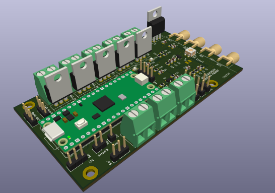

# **RF‑Sequencer**

The RF‑Sequencer provides deterministic, safe, and hardware‑independent control of RF transmit and receive path transitions.  
It is designed for radio systems that require strict sequencing, amplifier protection, and predictable relay behavior under all conditions.

The firmware architecture emphasizes clarity, safety, and long‑term maintainability.  
Relay hardware, timing rules, and protection logic are abstracted behind stable interfaces, ensuring consistent operation across diverse station configurations.
Earlier work, such as the concepts published by W1GHZ (Paul Wade) helped establish the fundamental principles of safe RF path control.
This RF‑Sequencer continues that lineage with a modern, firmware‑driven architecture that emphasizes clarity, determinism, and long‑term maintainability.

## **Key Features**

- Deterministic transmit/receive sequencing  
- Integrated protection engine with SAFE‑mode enforcement  
- High‑speed ADC sampling for forward and reflected power  
- VSWR and fast reflected‑spike protection (REF_FAST)
- Hardware‑independent relay abstraction  
- Support for monostable and latching relays  
- Configurable timing and topology  
- Structured event output for external integration  
- Minimal configuration surface  
- Designed for reliability in demanding RF environments  

## **Why Another Sequencer?**

Existing RF sequencers, including the influential **W1GHZ Mark 5**, proved that microcontroller‑based protection can outperform analog timing chains. But modern stations demand more: deterministic firmware behavior, structured telemetry, remote monitoring, fault latching, and safe operation in unattended or tower‑top installations.

This project was created to provide:

- A **fully deterministic** main‑loop architecture  
- **Sub‑millisecond protection paths** (REF_FAST)  
- A **machine‑readable event stream** for dashboards and automation  
- A **human‑readable logging channel** for operators  
- A **calibration system** that adapts to any coupler  
- A **robust SAFE‑mode model** suitable for remote sites  

In short: it’s a **next‑generation MCU sequencer**, built on the ideas that came before but engineered for today’s RF environments.

## **Documentation**

The documentation is organized into several focused areas:

### **Overview**
High‑level conceptual introduction to the system.  
- `docs/overview/overview.md`

### **Architecture**
Detailed subsystem specifications and internal design.  
- `docs/architecture/firmware-architecture.md`  
- `docs/architecture/relay-architecture.md`

### **Integration**
External systems can interact with the sequencer through a structured event stream.  
Events reflect internal state transitions, protection triggers, relay actions, and measurement updates.   
Guidance for consuming sequencer events and coordinating external systems:
- `docs/integration/event-monitoring-example.md`
- `docs/integration/integration-examples.md`
- `docs/integration/integration-guide.md`

### **Quickstart**
Installation‑specific setup and basic configuration.  
- `docs/quickstart/quickstart.md`

### **Reference (optional)**
Command‑line reference, event definitions, and configuration schema.  
- `docs/reference/`

## **Design Philosophy**

The RF‑Sequencer is built around several core principles:

- **Safety first** — protection logic overrides all other behavior  
- **Determinism** — no asynchronous state changes  
- **Hardware abstraction** — relay details are isolated behind stable interfaces  
- **Minimal configuration** — only essential structural parameters are exposed  
- **Predictability** — timing and transitions follow strict rules  

These principles ensure reliable operation in both simple and complex RF installations.

## **Contributing**

Contributions that improve clarity, safety, or maintainability are welcome.  
Please ensure that changes preserve the architectural principles described in the documentation.

# **License**

This project uses a dual‑license model:

- **Firmware:** binary‑only, see `LICENSE_FIRMWARE.md`
- **Hardware:** CERN OHL‑P, see `LICENSE_HARDWARE.md`

A human‑readable summary is provided in:

- `LICENSE_NOTICE.md`

